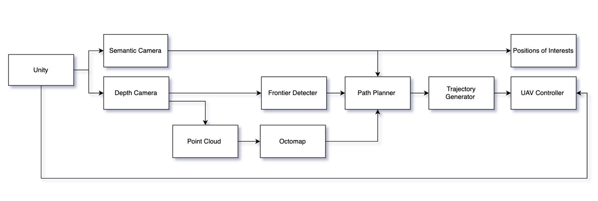

# AS_Challange

## `Working Students of Team 11`
1.  `Siyan Li`
2.  `Bingkun Huang`
3.  `Zhenjiang Li`
4.  `Haowen Shi`
5.  `Weili Tang`

## Project description
This project is part of the Sub-Terrain Challenge in the Autonomous Systems course at TUM.
The objective is to develop a system that can autonomously explore a cave environment, detect and locate four objects of interest (lights), and generate a 3D voxel-grid or mesh representation of the environment.
The implementation involves a ROS-based framework, integrating perception, path planning, and control using a quadrotor and a Unity-based simulation.

## Components

## How to:
1. Download the code from the [link](https://drive.google.com/file/d/1aNeNiHCVRwMLT9t8ftc_1FM-BobkdfQ9/view?usp=drive_link) (since some large file in Simulation is not uploaded into GitHub).

2. cd into the workspace

3. run catkin build

5. run ./start.sh

